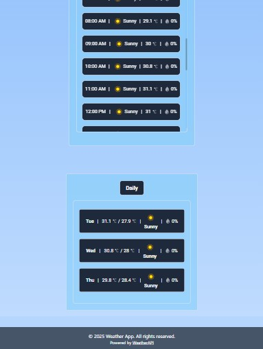

## Table of Contents
- [Features](#features)
- [Technologies Used](#technologies-used)
- [Installation](#installation)
- [Live Demo](#-live-demo)
- [Environment Variables](#environment-variables)
- [Screenshots](#screenshots)
  - [Responsive Design](#responsive-design)
- [How to Use](#how-to-use)
- [Credits / Acknowledgements](#-credits--acknowledgements)
# Weather Forecast App

A responsive React-based weather application that shows real-time forecasts, hourly reports, and 3-day predictions using WeatherAPI.

🚀 Features
City search with autocomplete

Real-time weather details (temperature, humidity, wind, etc.)

- 3-day forecast

- Hourly weather timeline

- Sunrise & sunset times

- Location-based (IP) detection

- Fully responsive & animated UI

- Toast notifications for errors

- Skeleton loading states

⚙️ Technologies Used
- React + Vite
- Tailwind CSS
- Axios
- WeatherAPI (Free plan)
- React Toastify
- Custom debounced search

 ## Installation
1. Clone the repository:
   ```bash
   git clone https://github.com/sagar-pendam/weather-App-Using-React.git
   ```
2. Change directory  
    ```bash
   cd weather-app
   ```

3.Install dependencies:
  ```bash
  npm install
   ```

4.Create a .env file in the root directory and add your API key:
 ```bash
  VITE_API_KEY=your_openweathermap_api_key
   ```

5.Start the development server:
  ```bash
 npm run dev
   ```
6.Open the app in your browser at
http://localhost:5173.

## 🌐 Live Demo

Check out the live demo of the Weather Forecast App here:

[Weather App Live Demo](https://weather-app-using-react-drab.vercel.app/)

## Environment Variables

The app requires an API key from OpenWeatherMap. Add the following to your .env file:
 ```bash
VITE_API_KEY=your_openweathermap_api_key
   ```


## Screenshots

### Home Screen


### Search Functionality


### Search Result


### Weather Details


### Weather Hourly Details


### Weather Daily Details


### Error Handling


## Responsive Design

### Mobile  View

### Home Screen


### Search Functionality


### Search Result


### Weather Details


### Weather Hourly Details


### Weather Daily Details


### Tablet  View

### Home Screen


### Search Functionality


### Search Result


### Weather Details


### Weather Hourly Details


### Weather Daily Details


## How to Use
1.Enter a city name in the search bar.

2.View the current weather details for the city.

3.If the city is not found, an error message will be displayed.

## 📌 Credits / Acknowledgements
WeatherAPI

Lordicon animations


